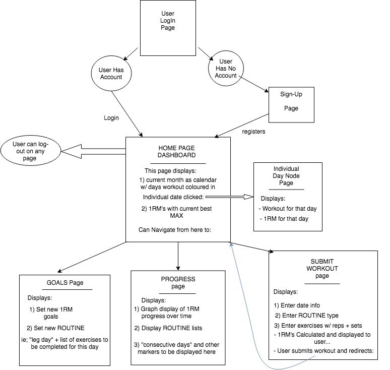
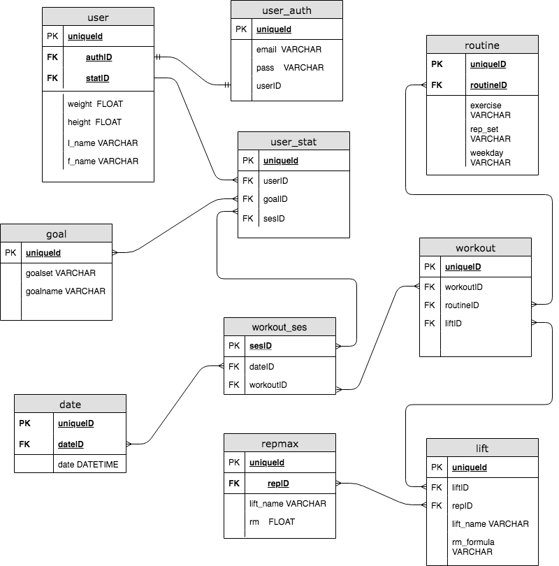

# The Strength Training Tracker
 

<h2> Pitch: </h2>

 This will be a web application that will allow you to track your strength training workouts over time, record progressive goals, and get a visual representation of your training over time in the form of helpful stats and graphs. The idea for building it comes from the fact that while there are many fitness trackers out there on the market, very few I find are helpful for my own personal strength training goals, and as such I would like to build one that I would use (and perhaps others would find usefull too). 

I find it very useful to know and train around optimizing my one rep max (https://en.wikipedia.org/wiki/One-repetition_maximum) and this application would be an ideal tool for doing this. 

It will be used after every workout to log your workout, record this progress over time, and give you insights into what you should do in order to maximize your time in the gym.  

 
 

<h2> Functional Requirements: </h2>

<ul> 
	<li> Will be written in Python and use the Django framework </li>
	<li> Most likely will use some form of front-end framework such as React, Vue.js, ect </li>
	<li> Will connect to some kind of Database managements software to record the user input (ie: MySQL, ect) </li>
	<li> Must store workouts, calculate 1RM, display this progress over time </li>
</ul>

 

<h2> Non-Functional Requirements: </h2>

<ul> 
        <li> Will be a web-application, but be mobile responsive (since probably will be used on a phone device) </li>
	<li> Use helpful visual representation ie; graphs ect </li>
</ul>

 
 

<h2> User-Flow Prototype </h2>
 

 Here is a basic wireframe mock-up of the application's features: 

 
 

 
 
 
<h2> Application Schema: </h2> 
 

